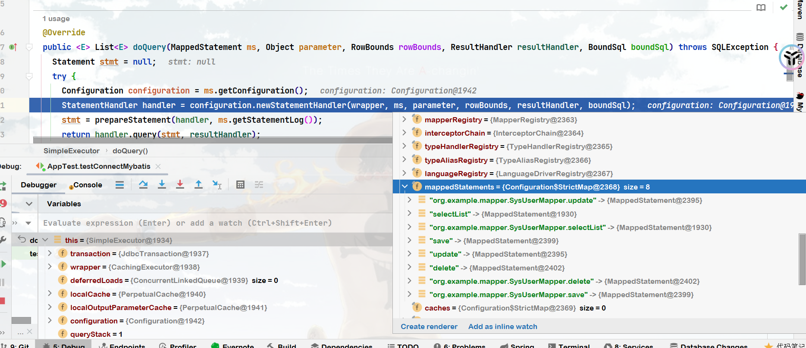
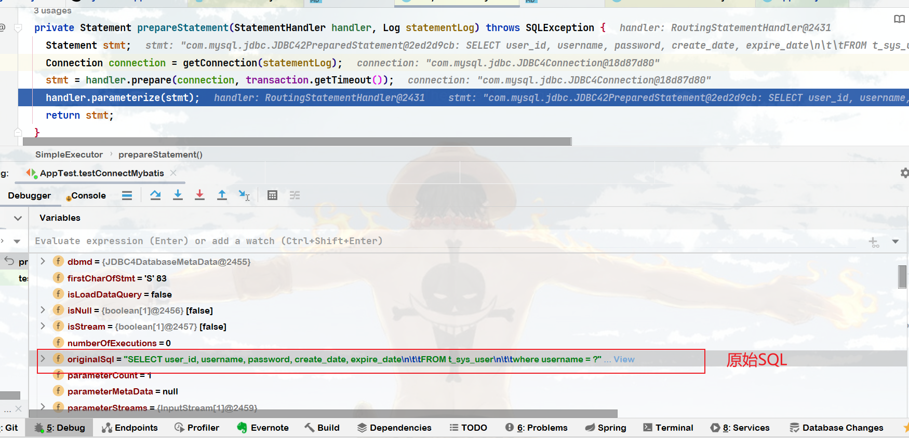
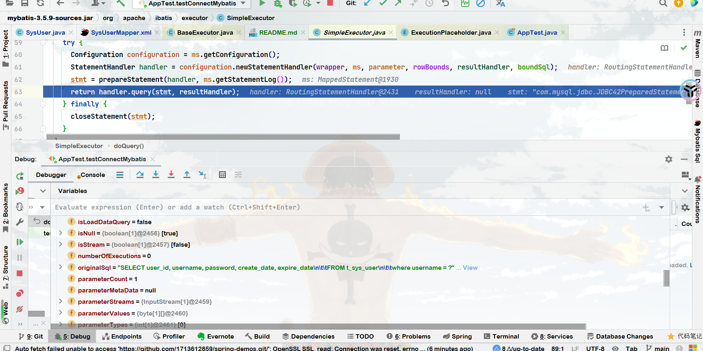

# Mybatis 源码解析


### Executor.doQuery() 


### OraginSql 



```markdown
statement = {JDBC42PreparedStatement@2450} "com.mysql.jdbc.JDBC42PreparedStatement@2ed2d9cb: SELECT user_id, username, password, create_date, expire_date\n\t\tFROM t_sys_user\n\t\twhere username = ** NOT SPECIFIED **"
 batchHasPlainStatements = false
 dbmd = {JDBC4DatabaseMetaData@2455} 
 firstCharOfStmt = 'S' 83
 isLoadDataQuery = false
 isNull = {boolean[1]@2456} [false]
 isStream = {boolean[1]@2457} [false]
 numberOfExecutions = 0
 originalSql = "SELECT user_id, username, password, create_date, expire_date\n\t\tFROM t_sys_user\n\t\twhere username = ?"
 parameterCount = 1
 parameterMetaData = null
 parameterStreams = {InputStream[1]@2459} 
 parameterValues = {byte[1][]@2460} 
 parameterTypes = {int[1]@2461} [0]
 parseInfo = {PreparedStatement$ParseInfo@2462} 
 pstmtResultMetaData = null
 staticSqlStrings = {byte[2][]@2463} 
 streamConvertBuf = null
 streamLengths = {int[1]@2464} [0]
 tsdf = null
 ddf = null
 tdf = null
 useTrueBoolean = true
 usingAnsiMode = false
 batchedValuesClause = null
 doPingInstead = false
 compensateForOnDuplicateKeyUpdate = false
 charsetEncoder = null
 batchCommandIndex = -1
 serverSupportsFracSecs = true
 rewrittenBatchSize = 0
 cancelTimeoutMutex = {Object@2465} 
 wasCancelled = false
 wasCancelledByTimeout = false
 batchedArgs = null
 charConverter = null
 charEncoding = "UTF-8"
 connection = {JDBC4Connection@2467} 
 physicalConnection = null
 currentCatalog = "bill"
 doEscapeProcessing = true
 fetchSize = 0
 isClosed = false
 lastInsertId = -1
 maxFieldSize = 4194304
 maxRows = -1
 openResults = {HashSet@2469}  size = 0
 pedantic = false
 profileSQL = false
 results = null
 generatedKeysResults = null
 resultSetConcurrency = 1007
 resultSetType = 1003
 statementId = 0
 timeoutInMillis = 0
 updateCount = -1
 useUsageAdvisor = false
 warningChain = null
 clearWarningsCalled = false
 holdResultsOpenOverClose = false
 batchedGeneratedKeys = null
 retrieveGeneratedKeys = false
 continueBatchOnError = true
 pingTarget = null
 useLegacyDatetimeCode = true
 sendFractionalSeconds = true
 exceptionInterceptor = null
 lastQueryIsOnDupKeyUpdate = false
 statementExecuting = {AtomicBoolean@2470} "false"
 isImplicitlyClosingResults = false
 originalResultSetType = 0
 originalFetchSize = 0
 isPoolable = true
 localInfileInputStream = null
 version5013OrNewer = true
 closeOnCompletion = false
```


