## Spring 源码解析

### 	1. Resource

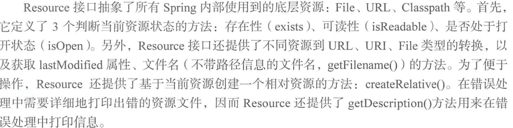


### 2. 

```
finalDefinition = {BeanDefinitionHolder@3198} "Bean definition with name 'userService' and aliases []: Generic bean: class [org.example.service.UserService]; scope=; abstract=false; lazyInit=false; autowireMode=0; dependencyCheck=0; autowireCandidate=true; primary=false; factoryBeanName=null; factoryMethodName=null; initMethodName=null; destroyMethodName=null; defined in class path resource [applicationContext.xml]"
 beanDefinition = {GenericBeanDefinition@3166} "Generic bean: class [org.example.service.UserService]; scope=; abstract=false; lazyInit=false; autowireMode=0; dependencyCheck=0; autowireCandidate=true; primary=false; factoryBeanName=null; factoryMethodName=null; initMethodName=null; destroyMethodName=null; defined in class path resource [applicationContext.xml]"
 beanName = "userService"
 aliases = {String[0]@3202} []
 
 
	/**
	 * Decorate the given bean definition through a namespace handler, if applicable.
	 * @param ele the current element
	 * @param originalDef the current bean definition
	 * @return the decorated bean definition
	 	绑定命名空间 设置默认参数
	 */
	public BeanDefinitionHolder decorateBeanDefinitionIfRequired(Element ele, BeanDefinitionHolder originalDef) {
		return decorateBeanDefinitionIfRequired(ele, originalDef, null);
	}
```


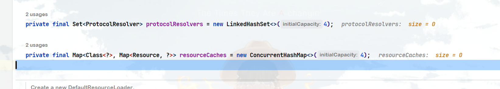


**ClasspathXmlApplicationContext**

​	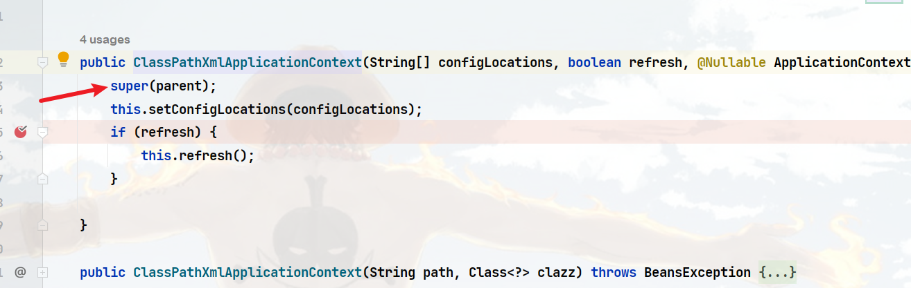

* 

* ```Java
  this.setConfigLocations(configLocations); 
  	设置配置项路径 即resource下的applicationConext.xml
  ```

* 调用父类无参构造初始化

  * 设置

```
public AbstractApplicationContext() {
    this.logger = LogFactory.getLog(this.getClass());
    this.id = ObjectUtils.identityToString(this);
    this.displayName = ObjectUtils.identityToString(this);
    this.beanFactoryPostProcessors = new ArrayList();
    this.active = new AtomicBoolean();
    this.closed = new AtomicBoolean();
    this.startupShutdownMonitor = new Object();
    this.applicationStartup = ApplicationStartup.DEFAULT;
    this.applicationListeners = new LinkedHashSet();
    this.resourcePatternResolver = this.getResourcePatternResolver();
}
```


```
/**
 * Create a new DefaultListableBeanFactory with the given parent.
 * @param parentBeanFactory the parent BeanFactory
 */
public DefaultListableBeanFactory(@Nullable BeanFactory parentBeanFactory) {
  super(parentBeanFactory);
}
```

* refresh 方法  初始化Bean 容器  注册Bean定义  对某个Bean增强   
* 


调用DefaultLisableBeanfactory 默认无参构造初始化属性

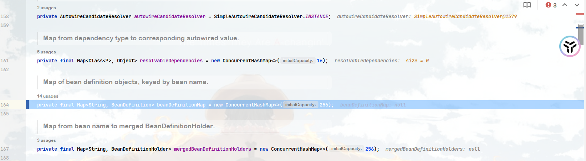


初始化

```
beanFactory = {DefaultListableBeanFactory@1261} "org.springframework.beans.factory.support.DefaultListableBeanFactory@34cd072c: defining beans []; root of factory hierarchy"
 serializationId = null
 allowBeanDefinitionOverriding = true
 allowEagerClassLoading = true
 dependencyComparator = null
 autowireCandidateResolver = {SimpleAutowireCandidateResolver@1579} 
 resolvableDependencies = {ConcurrentHashMap@1583}  size = 0
 beanDefinitionMap = {ConcurrentHashMap@1586}  size = 0
 mergedBeanDefinitionHolders = {ConcurrentHashMap@1589}  size = 0
 allBeanNamesByType = {ConcurrentHashMap@1592}  size = 0
 singletonBeanNamesByType = {ConcurrentHashMap@1595}  size = 0
 beanDefinitionNames = {ArrayList@1598}  size = 0
 manualSingletonNames = {LinkedHashSet@1601}  size = 0
 frozenBeanDefinitionNames = null
 configurationFrozen = false
 instantiationStrategy = {CglibSubclassingInstantiationStrategy@1340} 
 parameterNameDiscoverer = {DefaultParameterNameDiscoverer@1341} 
 allowCircularReferences = true
 allowRawInjectionDespiteWrapping = false
 ignoredDependencyTypes = {HashSet@1342}  size = 0
 ignoredDependencyInterfaces = {HashSet@1343}  size = 3
 currentlyCreatedBean = {NamedThreadLocal@1344} "Currently created bean"
 factoryBeanInstanceCache = {ConcurrentHashMap@1345}  size = 0
 factoryMethodCandidateCache = {ConcurrentHashMap@1346}  size = 0
 filteredPropertyDescriptorsCache = {ConcurrentHashMap@1347}  size = 0
 parentBeanFactory = null
 beanClassLoader = {Launcher$AppClassLoader@532} 
 tempClassLoader = null
 cacheBeanMetadata = true
 beanExpressionResolver = null
 conversionService = null
 propertyEditorRegistrars = {LinkedHashSet@1348}  size = 0
 customEditors = {HashMap@1349}  size = 0
 typeConverter = null
 embeddedValueResolvers = {CopyOnWriteArrayList@1350}  size = 0
 beanPostProcessors = {AbstractBeanFactory$BeanPostProcessorCacheAwareList@1351}  size = 0
 beanPostProcessorCache = null
 scopes = {LinkedHashMap@1352}  size = 0
 securityContextProvider = null
 mergedBeanDefinitions = {ConcurrentHashMap@1353}  size = 0
 alreadyCreated = {Collections$SetFromMap@1354}  size = 0
 prototypesCurrentlyInCreation = {NamedThreadLocal@1355} "Prototype beans currently in creation"
 applicationStartup = {DefaultApplicationStartup@646} 
 factoryBeanObjectCache = {ConcurrentHashMap@1356}  size = 0
 singletonObjects = {ConcurrentHashMap@1357}  size = 0
 singletonFactories = {HashMap@1358}  size = 0
 earlySingletonObjects = {ConcurrentHashMap@1359}  size = 0
 registeredSingletons = {LinkedHashSet@1360}  size = 0
 singletonsCurrentlyInCreation = {Collections$SetFromMap@1361}  size = 0
 inCreationCheckExclusions = {Collections$SetFromMap@1362}  size = 0
 suppressedExceptions = null
 singletonsCurrentlyInDestruction = false
 disposableBeans = {LinkedHashMap@1363}  size = 0
 containedBeanMap = {ConcurrentHashMap@1364}  size = 0
 dependentBeanMap = {ConcurrentHashMap@1365}  size = 0
 dependenciesForBeanMap = {ConcurrentHashMap@1366}  size = 0
 logger = {LogAdapter$JavaUtilLog@1367} 
 aliasMap = {ConcurrentHashMap@1368}  size = 0
```


* loadBeanDefinitions（） 定义加载Bean定义信息

```
    protected void loadBeanDefinitions(DefaultListableBeanFactory beanFactory) throws BeansException, IOException {
        XmlBeanDefinitionReader beanDefinitionReader = new XmlBeanDefinitionReader(beanFactory);
        beanDefinitionReader.setEnvironment(this.getEnvironment());
        beanDefinitionReader.setResourceLoader(this);
        beanDefinitionReader.setEntityResolver(new ResourceEntityResolver(this));
        this.initBeanDefinitionReader(beanDefinitionReader);
        this.loadBeanDefinitions(beanDefinitionReader);
    }
```


* doLoadBeanDefinitions

  ```java
  	protected int doLoadBeanDefinitions(InputSource inputSource, Resource resource)
  			throws BeanDefinitionStoreException {
  
  		try {
  			Document doc = doLoadDocument(inputSource, resource);
  			int count = registerBeanDefinitions(doc, resource);
  			if (logger.isDebugEnabled()) {
  				logger.debug("Loaded " + count + " bean definitions from " + resource);
  			}
  			return count;
  		}
  		catch (BeanDefinitionStoreException ex) {
  			throw ex;
  		}
  		catch (SAXParseException ex) {
  			throw new XmlBeanDefinitionStoreException(resource.getDescription(),
  					"Line " + ex.getLineNumber() + " in XML document from " + resource + " is invalid", ex);
  		}
  		catch (SAXException ex) {
  			throw new XmlBeanDefinitionStoreException(resource.getDescription(),
  					"XML document from " + resource + " is invalid", ex);
  		}
  		catch (ParserConfigurationException ex) {
  			throw new BeanDefinitionStoreException(resource.getDescription(),
  					"Parser configuration exception parsing XML from " + resource, ex);
  		}
  		catch (IOException ex) {
  			throw new BeanDefinitionStoreException(resource.getDescription(),
  					"IOException parsing XML document from " + resource, ex);
  		}
  		catch (Throwable ex) {
  			throw new BeanDefinitionStoreException(resource.getDescription(),
  					"Unexpected exception parsing XML document from " + resource, ex);
  		}
  	}
  ```


初始化默认

```java
/**
 * Initialize the default lazy-init, autowire, dependency check settings,
 * init-method, destroy-method and merge settings. Support nested 'beans'
 * element use cases by falling back to the given parent in case the
 * defaults are not explicitly set locally.
 * @see #populateDefaults(DocumentDefaultsDefinition, DocumentDefaultsDefinition, org.w3c.dom.Element)
 * @see #getDefaults()
 */
public void initDefaults(Element root, @Nullable BeanDefinitionParserDelegate parent) {
  populateDefaults(this.defaults, (parent != null ? parent.defaults : null), root);
  this.readerContext.fireDefaultsRegistered(this.defaults);
}
```

*  populateDefaults 为Bean 填充默认值

```
protected void populateDefaults(DocumentDefaultsDefinition defaults, @Nullable DocumentDefaultsDefinition parentDefaults, Element root) {
  String lazyInit = root.getAttribute(DEFAULT_LAZY_INIT_ATTRIBUTE);
  if (isDefaultValue(lazyInit)) {
    // Potentially inherited from outer <beans> sections, otherwise falling back to false.
    lazyInit = (parentDefaults != null ? parentDefaults.getLazyInit() : FALSE_VALUE);
  }
  defaults.setLazyInit(lazyInit);

  String merge = root.getAttribute(DEFAULT_MERGE_ATTRIBUTE);
  if (isDefaultValue(merge)) {
    // Potentially inherited from outer <beans> sections, otherwise falling back to false.
    merge = (parentDefaults != null ? parentDefaults.getMerge() : FALSE_VALUE);
  }
  defaults.setMerge(merge);

  String autowire = root.getAttribute(DEFAULT_AUTOWIRE_ATTRIBUTE);
  if (isDefaultValue(autowire)) {
    // Potentially inherited from outer <beans> sections, otherwise falling back to 'no'.
    autowire = (parentDefaults != null ? parentDefaults.getAutowire() : AUTOWIRE_NO_VALUE);
  }
  defaults.setAutowire(autowire);

  if (root.hasAttribute(DEFAULT_AUTOWIRE_CANDIDATES_ATTRIBUTE)) {
    defaults.setAutowireCandidates(root.getAttribute(DEFAULT_AUTOWIRE_CANDIDATES_ATTRIBUTE));
  }
  else if (parentDefaults != null) {
    defaults.setAutowireCandidates(parentDefaults.getAutowireCandidates());
  }

  if (root.hasAttribute(DEFAULT_INIT_METHOD_ATTRIBUTE)) {
    defaults.setInitMethod(root.getAttribute(DEFAULT_INIT_METHOD_ATTRIBUTE));
  }
  else if (parentDefaults != null) {
    defaults.setInitMethod(parentDefaults.getInitMethod());
  }

  if (root.hasAttribute(DEFAULT_DESTROY_METHOD_ATTRIBUTE)) {
    defaults.setDestroyMethod(root.getAttribute(DEFAULT_DESTROY_METHOD_ATTRIBUTE));
  }
  else if (parentDefaults != null) {
    defaults.setDestroyMethod(parentDefaults.getDestroyMethod());
  }

  defaults.setSource(this.readerContext.extractSource(root));
}
```


* processBeanDefinition 最终进行Bean 定义

```Java
protected void processBeanDefinition(Element ele, BeanDefinitionParserDelegate delegate) {
  BeanDefinitionHolder bdHolder = delegate.parseBeanDefinitionElement(ele);
  if (bdHolder != null) {
    bdHolder = delegate.decorateBeanDefinitionIfRequired(ele, bdHolder);
    try {
      // Register the final decorated instance.
      BeanDefinitionReaderUtils.registerBeanDefinition(bdHolder, getReaderContext().getRegistry());
    }
    catch (BeanDefinitionStoreException ex) {
      getReaderContext().error("Failed to register bean definition with name '" +
          bdHolder.getBeanName() + "'", ele, ex);
    }
    // Send registration event.
    getReaderContext().fireComponentRegistered(new BeanComponentDefinition(bdHolder));
  }
}
```


* 注册Bean

```Java
@Override
public void registerBeanDefinition(String beanName, BeanDefinition beanDefinition)
    throws BeanDefinitionStoreException {

  Assert.hasText(beanName, "Bean name must not be empty");
  Assert.notNull(beanDefinition, "BeanDefinition must not be null");

  if (beanDefinition instanceof AbstractBeanDefinition) {
    try {
      ((AbstractBeanDefinition) beanDefinition).validate();
    }
    catch (BeanDefinitionValidationException ex) {
      throw new BeanDefinitionStoreException(beanDefinition.getResourceDescription(), beanName,
          "Validation of bean definition failed", ex);
    }
  }

  BeanDefinition existingDefinition = this.beanDefinitionMap.get(beanName);
  if (existingDefinition != null) {
    if (!isAllowBeanDefinitionOverriding()) {
      throw new BeanDefinitionOverrideException(beanName, beanDefinition, existingDefinition);
    }
    else if (existingDefinition.getRole() < beanDefinition.getRole()) {
      // e.g. was ROLE_APPLICATION, now overriding with ROLE_SUPPORT or ROLE_INFRASTRUCTURE
      if (logger.isInfoEnabled()) {
        logger.info("Overriding user-defined bean definition for bean '" + beanName +
            "' with a framework-generated bean definition: replacing [" +
            existingDefinition + "] with [" + beanDefinition + "]");
      }
    }
    else if (!beanDefinition.equals(existingDefinition)) {
      if (logger.isDebugEnabled()) {
        logger.debug("Overriding bean definition for bean '" + beanName +
            "' with a different definition: replacing [" + existingDefinition +
            "] with [" + beanDefinition + "]");
      }
    }
    else {
      if (logger.isTraceEnabled()) {
        logger.trace("Overriding bean definition for bean '" + beanName +
            "' with an equivalent definition: replacing [" + existingDefinition +
            "] with [" + beanDefinition + "]");
      }
    }
    this.beanDefinitionMap.put(beanName, beanDefinition);
  }
  else {
    if (hasBeanCreationStarted()) {
      // Cannot modify startup-time collection elements anymore (for stable iteration)
      synchronized (this.beanDefinitionMap) {
        this.beanDefinitionMap.put(beanName, beanDefinition);
        List<String> updatedDefinitions = new ArrayList<>(this.beanDefinitionNames.size() + 1);
        updatedDefinitions.addAll(this.beanDefinitionNames);
        updatedDefinitions.add(beanName);
        this.beanDefinitionNames = updatedDefinitions;
        removeManualSingletonName(beanName);
      }
    }
    else {
      // Still in startup registration phase
      this.beanDefinitionMap.put(beanName, beanDefinition);
      this.beanDefinitionNames.add(beanName);
      removeManualSingletonName(beanName);
    }
    this.frozenBeanDefinitionNames = null;
  }

  if (existingDefinition != null || containsSingleton(beanName)) {
    resetBeanDefinition(beanName);
  }
  else if (isConfigurationFrozen()) {
    clearByTypeCache();
  }
}
```

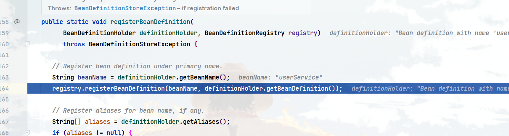


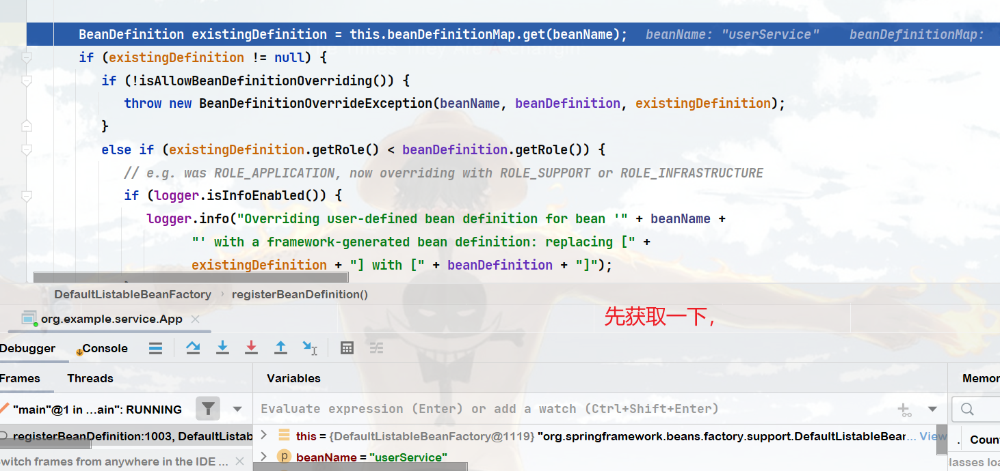


没有，再判断是否还在启动中？

在 加锁定义

不在 直接将beanName 加入到一个LinikList

className 加入到 BeanDifintions的Map中

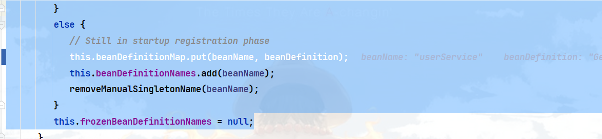


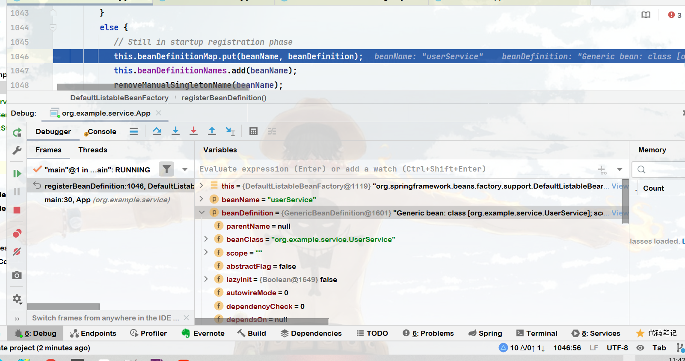


```java
beanDefinition = {GenericBeanDefinition@1601} "Generic bean: class [org.example.service.UserService]; scope=; abstract=false; lazyInit=false; autowireMode=0; dependencyCheck=0; autowireCandidate=true; primary=false; factoryBeanName=null; factoryMethodName=null; initMethodName=null; destroyMethodName=null; defined in class path resource [applicationContext.xml]"
 parentName = null
 beanClass = "org.example.service.UserService"
 scope = ""
 abstractFlag = false
 lazyInit = {Boolean@1649} false
 autowireMode = 0
 dependencyCheck = 0
 dependsOn = null
 autowireCandidate = true
 primary = false
 qualifiers = {LinkedHashMap@1650}  size = 0
 instanceSupplier = null
 nonPublicAccessAllowed = true
 lenientConstructorResolution = true
 factoryBeanName = null
 factoryMethodName = null
 constructorArgumentValues = {ConstructorArgumentValues@1651} 
 propertyValues = null
 methodOverrides = {MethodOverrides@1652} 
 initMethodName = null
 destroyMethodName = null
 enforceInitMethod = true
 enforceDestroyMethod = true
 synthetic = false
 role = 0
 description = null
 resource = {DefaultResourceLoader$ClassPathContextResource@1653} "class path resource [applicationContext.xml]"
 source = null
 attributes = {LinkedHashMap@1654}  size = 0
```


删除单例Bean名称

```Java
private void removeManualSingletonName(String beanName) {
  updateManualSingletonNames(set -> set.remove(beanName), set -> set.contains(beanName));
}
```


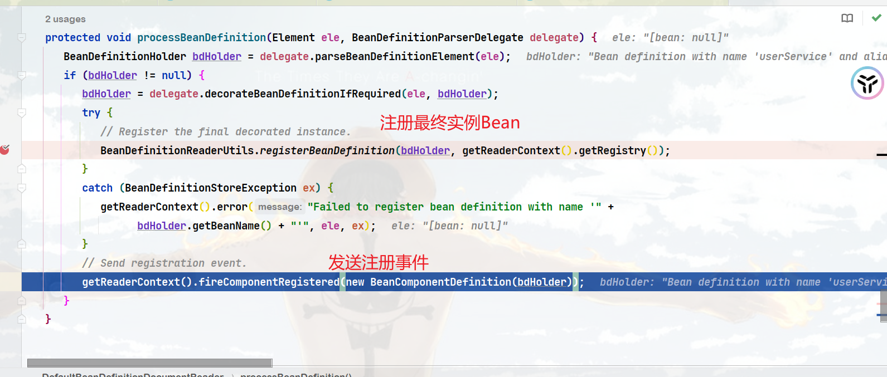


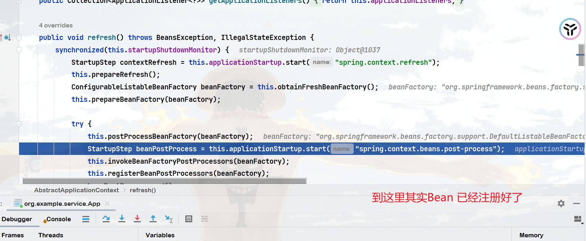


下面就是解析Bean增强


context 

```java
resource = {ClassPathResource@534} "class path resource [applicationContext.xml]"
context = {ClassPathXmlApplicationContext@1027} "org.springframework.context.support.ClassPathXmlApplicationContext@6cd8737, started on Sat Aug 26 11:37:30 CST 2023"
 configResources = null
 validating = true
 configLocations = {String[1]@1029} ["applicationCont..."]
 setIdCalled = false
 allowBeanDefinitionOverriding = null
 allowCircularReferences = null
 beanFactory = {DefaultListableBeanFactory@1119} "org.springframework.beans.factory.support.DefaultListableBeanFactory@7d68ef40: defining beans [userService]; root of factory hierarchy"
  serializationId = "org.springframework.context.support.ClassPathXmlApplicationContext@6cd8737"
  allowBeanDefinitionOverriding = true
  allowEagerClassLoading = true
  dependencyComparator = null
  autowireCandidateResolver = {SimpleAutowireCandidateResolver@1603} 
  resolvableDependencies = {ConcurrentHashMap@1604}  size = 4
  beanDefinitionMap = {ConcurrentHashMap@1602}  size = 1
  mergedBeanDefinitionHolders = {ConcurrentHashMap@1605}  size = 0
  allBeanNamesByType = {ConcurrentHashMap@1606}  size = 0
  singletonBeanNamesByType = {ConcurrentHashMap@1607}  size = 0
  beanDefinitionNames = {ArrayList@1608}  size = 1
  manualSingletonNames = {LinkedHashSet@9991}  size = 7
  frozenBeanDefinitionNames = {String[1]@9992} ["userService"]
  configurationFrozen = true
  instantiationStrategy = {CglibSubclassingInstantiationStrategy@1610} 
  parameterNameDiscoverer = {DefaultParameterNameDiscoverer@1611} 
  allowCircularReferences = true
  allowRawInjectionDespiteWrapping = false
  ignoredDependencyTypes = {HashSet@1612}  size = 0
  ignoredDependencyInterfaces = {HashSet@1613}  size = 10
  currentlyCreatedBean = {NamedThreadLocal@1614} "Currently created bean"
  factoryBeanInstanceCache = {ConcurrentHashMap@1615}  size = 0
  factoryMethodCandidateCache = {ConcurrentHashMap@1616}  size = 0
  filteredPropertyDescriptorsCache = {ConcurrentHashMap@1617}  size = 0
  parentBeanFactory = null
  beanClassLoader = {Launcher$AppClassLoader@532} 
  tempClassLoader = null
  cacheBeanMetadata = true
  beanExpressionResolver = {StandardBeanExpressionResolver@2759} 
  conversionService = null
  propertyEditorRegistrars = {LinkedHashSet@1618}  size = 1
  customEditors = {HashMap@1619}  size = 0
  typeConverter = null
  embeddedValueResolvers = {CopyOnWriteArrayList@1620}  size = 1
  beanPostProcessors = {AbstractBeanFactory$BeanPostProcessorCacheAwareList@1621}  size = 3
  beanPostProcessorCache = {AbstractBeanFactory$BeanPostProcessorCache@9993} 
  scopes = {LinkedHashMap@1622}  size = 0
  securityContextProvider = null
  mergedBeanDefinitions = {ConcurrentHashMap@1623}  size = 1
  alreadyCreated = {Collections$SetFromMap@1624}  size = 1
  prototypesCurrentlyInCreation = {NamedThreadLocal@1625} "Prototype beans currently in creation"
  applicationStartup = {DefaultApplicationStartup@1039} 
  factoryBeanObjectCache = {ConcurrentHashMap@1626}  size = 0
  singletonObjects = {ConcurrentHashMap@1627}  size = 8
  singletonFactories = {HashMap@1628}  size = 0
  earlySingletonObjects = {ConcurrentHashMap@1629}  size = 0
  registeredSingletons = {LinkedHashSet@1630}  size = 8
  singletonsCurrentlyInCreation = {Collections$SetFromMap@1631}  size = 0
  inCreationCheckExclusions = {Collections$SetFromMap@1632}  size = 0
  suppressedExceptions = null
  singletonsCurrentlyInDestruction = false
  disposableBeans = {LinkedHashMap@1633}  size = 0
  containedBeanMap = {ConcurrentHashMap@1634}  size = 0
  dependentBeanMap = {ConcurrentHashMap@1635}  size = 0
  dependenciesForBeanMap = {ConcurrentHashMap@1636}  size = 0
  logger = {LogAdapter$JavaUtilLog@1637} 
  aliasMap = {ConcurrentHashMap@1638}  size = 0
 logger = {LogAdapter$JavaUtilLog@1030} 
 id = "org.springframework.context.support.ClassPathXmlApplicationContext@6cd8737"
 displayName = "org.springframework.context.support.ClassPathXmlApplicationContext@6cd8737"
 parent = null
 environment = {StandardEnvironment@1033} "StandardEnvironment {activeProfiles=[], defaultProfiles=[default], propertySources=[PropertiesPropertySource {name='systemProperties'}, SystemEnvironmentPropertySource {name='systemEnvironment'}]}"
 beanFactoryPostProcessors = {ArrayList@1034}  size = 0
 startupDate = 1693021050307
 active = {AtomicBoolean@1035} "true"
 closed = {AtomicBoolean@1036} "false"
 startupShutdownMonitor = {Object@1037} 
 shutdownHook = null
 resourcePatternResolver = {PathMatchingResourcePatternResolver@1038} 
 lifecycleProcessor = {DefaultLifecycleProcessor@3997} 
 messageSource = {DelegatingMessageSource@3415} "Empty MessageSource"
 applicationEventMulticaster = {SimpleApplicationEventMulticaster@3454} 
 applicationStartup = {DefaultApplicationStartup@1039} 
 applicationListeners = {LinkedHashSet@1040}  size = 0
 earlyApplicationListeners = {LinkedHashSet@2686}  size = 0
 earlyApplicationEvents = null
 classLoader = null
 protocolResolvers = {LinkedHashSet@1041}  size = 0
 resourceCaches = {ConcurrentHashMap@1042}  size = 0
```


命令空间获取Bean实例

```Java
/**
 * Return the corresponding bean instance.
 */
public T getBeanInstance() {
  return this.beanInstance;
}
```


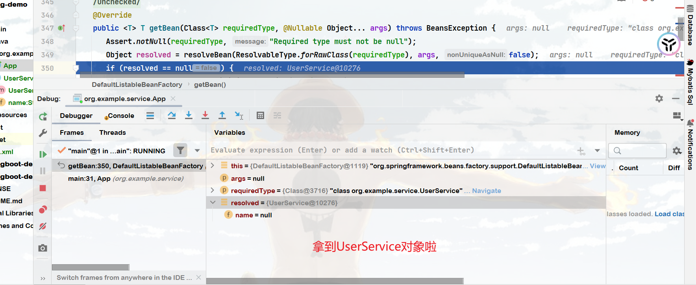


获取UserService对象 **SUCCESS**

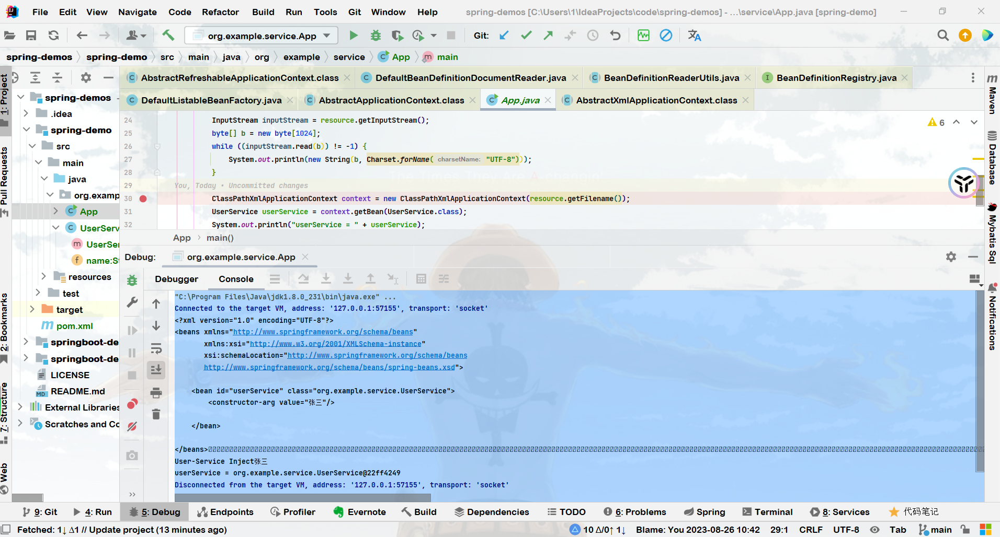