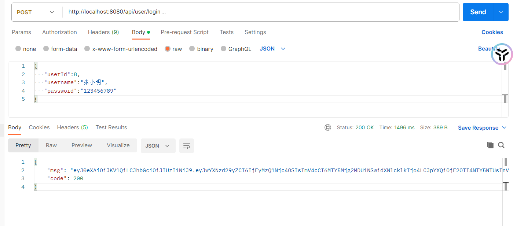
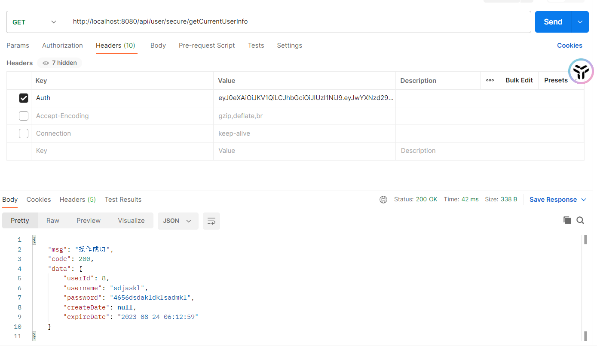

# JWT 简单实用
## 1. 创建用户对象  SysUser
```java
@Data
@AllArgsConstructor
@NoArgsConstructor
public class SysUser {

	 /**
	  * 用户id
	  */
	 private Long userId;
	 /**
	  * 用户名
	  */
	 private String username;
	 /**
	  * 密码
	  */
	 private String password;
	 /**
	  * 创建日期
	  */
	 @JsonFormat(pattern = "yyyy-MM-dd HH:mm:ss")
	 private Date createDate;
	 /**
	  * 登录日期
	  */
	 @JsonFormat(pattern = "yyyy-MM-dd HH:mm:ss")
	 private Date expireDate;
}
```

## 2. 引入JWT
```xml
	    <!-- 引入jwt-->
		<dependency>
			<groupId>com.auth0</groupId>
			<artifactId>java-jwt</artifactId>
			<version>3.8.2</version>
		</dependency>
```
## 3. 创建jwt工具类
```java
package utils;

import com.auth0.jwt.JWT;
import com.auth0.jwt.JWTVerifier;
import com.auth0.jwt.algorithms.Algorithm;
import com.auth0.jwt.interfaces.Claim;
import com.auth0.jwt.interfaces.DecodedJWT;
import com.example.domian.SysUser;

import java.util.Date;
import java.util.HashMap;
import java.util.Map;

/**
 * @Author LiuYunLong
 * @CREATE_DATE 2023-08-24
 * @DOC 24
 */
public class JwtTokenUtils {
	 // 密钥
	 private static final String SECRET = "jwtSECRET";
	 // 3600 秒
	 private static final long EXPIRATION = 3600L;

	 /**
	  * 创建令牌
	  *
	  * @param sysUser 系统用户
	  * @return {@link String}
	  */
	 public static String createToken(SysUser sysUser) {
		  Date expireDate = new Date(System.currentTimeMillis() + EXPIRATION * 1000);
		  Map<String, Object> map = new HashMap<>();
		  map.put("alg", "HS256");
		  map.put("typ", "JWT");
		  System.out.println(sysUser + "user");
		  String token =
					 // 这里的Claim 其实就是签名，根据签名生成一个token信息
					 // token 又分为三段 中间那段才是用户信息
					 JWT.create().withClaim("userId", sysUser.getUserId())
								.withClaim("username", sysUser.getUsername())
								.withClaim("password", sysUser.getPassword())
								.withExpiresAt(expireDate).withIssuedAt(new Date())
								.sign(Algorithm.HMAC256(SECRET));

		  return token;

	 }


	 /**
	  * 验证令牌
	  *
	  * @param token 令牌
	  * @return {@link Map}<{@link String}, {@link Claim}>
	  */
	 public static Map<String, Claim> verifyToken(String token) {
		  DecodedJWT jwt = null;
		  try {
				// 利用秘钥 验证token
				JWTVerifier verifier = JWT.require(Algorithm.HMAC256(SECRET)).build();
				jwt = verifier.verify(token);
		  }
		  catch (Exception e) {
				return null;
		  }
		  // 返回签名对象
		  return jwt.getClaims();
	 }


	 /**
	  * 根据token获取SysUser 对象
	  *
	  * @param token 令牌
	  * @return {@link SysUser}
	  */
	 public static SysUser getPayload(String token) {

		  DecodedJWT jwt = null;
		  JWTVerifier jwtVerifier = JWT.require(Algorithm.HMAC256(SECRET)).build();
		  DecodedJWT decodedJWT = jwtVerifier.verify(token);
		  Map<String, Claim> claims = decodedJWT.getClaims();
		  Long userId = claims.get("userId").asLong();
		  String username = claims.get("username").asString();
		  String password = claims.get("password").asString();
		  long time = decodedJWT.getExpiresAt().getTime();

		  SysUser sysUser = new SysUser();
		  sysUser.setUserId(userId);
		  sysUser.setUsername(username);
		  sysUser.setPassword(password);
		  sysUser.setExpireDate(new Date(time));

		  return sysUser;

	 }
}

```

## 4.创建 jwtFilter .实现Filter中#doFilter()方法 
Filter 过滤，也可以理解为拦截，拦截请求，本质不同，但是都是在拦截访问某个接口之前

```java
package com.example.filter;

import com.auth0.jwt.interfaces.Claim;
import org.springframework.http.HttpMethod;
import com.example.utils.JwtTokenUtils;

import javax.servlet.*;
import javax.servlet.annotation.WebFilter;
import javax.servlet.http.HttpServletRequest;
import javax.servlet.http.HttpServletResponse;
import java.io.IOException;
import java.util.Map;

/**
 * jwt过滤器
 *
 * @Author LiuYunLong
 * @CREATE_DATE 2023-08-24
 * @DOC jwt过滤器
 * @date 2023/08/24 11:31:23
 */
// /api/user/secure/* URL 请求路径起作用
@WebFilter(filterName = "JwtFilter", urlPatterns = "/api/user/secure/*")
/**
 * @WebFilter WEB过滤器，urlPatterns 就是拦截当前应用路径下的 /api/user/secure/*
 * 如果请求头没有token 返回 no token
 * 有token 构建用户对象返回回去即可 我们通过解密构建用户对象
 */ public class JwtFilter implements Filter {
	 @Override
	 public void doFilter(ServletRequest req, ServletResponse res, FilterChain filterChain) throws IOException, ServletException {
		  final HttpServletRequest request = (HttpServletRequest) req;
		  final HttpServletResponse response = (HttpServletResponse) res;

		  response.setCharacterEncoding("UTF-8");

		  final String token = request.getHeader("Auth");
		  // 是否是 OPTIONS 请求
		  if (HttpMethod.OPTIONS.name().equals(request.getMethod())) {
				response.setStatus(HttpServletResponse.SC_OK);
				filterChain.doFilter(request, response);
		  }
		  else {
				if (token == null) {
					 response.getWriter().write("no token");
					 return;
				}
				// 检验 token
				Map<String, Claim> userData = JwtTokenUtils.verifyToken(token);
				if (userData == null) {
					 response.getWriter().write("token illegal");
					 return;
				}
				filterChain.doFilter(req, res); // 过滤成功
		  }

	 }
}

```

## 5. 用户登录 （不能被拦截，拦截了那还怎么创建token）
```java
	 @PostMapping("/login")
	 public AjaxResult login(@RequestBody SysUser user) {
		  String token = JwtTokenUtils.createToken(user);
		  return AjaxResult.success(token);
	 }
```



## 6. 根据token获取当前用户信息
```java

	 /**
	  * 当前注册人
	  *
	  * @param request 请求
	  * @return {@link AjaxResult}
	  */
	 @GetMapping("/secure/getCurrentUserInfo")
	 public AjaxResult currentUser(HttpServletRequest request) {
		  String token = request.getHeader("Auth");
		  SysUser user = null;
		  System.out.println("token = " + token);
		  if (!StringUtils.isEmpty(token)) {
				user = JwtTokenUtils.getPayload(token);
		  }
		  return AjaxResult.success(user);
	 }
```
接下来就是答案啦
